# Pulse AI - Revenue Cycle Management (RCM) Intelligence Platform

[](https://github.com/Navneet-Scaler/PulseAI)
[](https://navneet-scaler-pulseai-srcapp-yyiaqz.streamlit.app/)

### The Problem
Healthcare organizations lose millions in revenue due to insurance claim denials caused by incorrect clinical coding (CPT/ICD-10 errors). While autonomous AI coding speeds up submissions, routing low-confidence predictions directly to payers results in high denial rates, while routing too many claims to human auditors increases administrative overhead and labor costs.

### The Solution
**Pulse AI** is an event-driven Revenue Cycle Management (RCM) billing intelligence and simulation platform. It models autonomous medical coding, human-in-the-loop (HIL) audit routing, payer claim adjudication, and analytics tracking. The system features a dynamic threshold optimizer that calculates an empirical "Trust Horizon" to find the financial sweet spot balancing auditor labor costs against prevented denials.

### The Target Audience
This platform is designed for **RCM Directors**, **Healthcare Product Managers**, and **Clinical AI Engineers** to test autonomous coding thresholds, track billing KPIs, and establish quality gates before deploying AI models to live billing pipelines.

---

### Visual Workflow & Pipeline Architecture

```mermaid
graph LR
    %% Styling Classes
    classDef input fill:#1E293B,stroke:#475569,stroke-width:1px,color:#F8FAFC;
    classDef engine fill:#0F172A,stroke:#0D9488,stroke-width:2px,color:#F1F5F9;
    classDef metric fill:#1E293B,stroke:#334155,stroke-width:1px,color:#F8FAFC;
    classDef gate fill:#7F1D1D,stroke:#F87171,stroke-width:1.5px,color:#FEE2E2;
    classDef pass fill:#064E3B,stroke:#34D399,stroke-width:1.5px,color:#D1FAE5;

    %% Data Nodes
    A["EHR Clinical Notes <br> (Patient Encounters)"]:::input
    B["AI Autonomous Coder <br> (CPT / ICD-10 Predictions)"]:::input

    %% Processing Nodes
    C{"Confidence Router <br> (Confidence vs. Threshold)"}:::engine
    D["Human Auditor Queue <br> (Error Correction & Review)"]:::engine
    E["Payer Adjudication Engine <br> (Rule-based Claim processing)"]:::engine

    %% Analytics & Observability Nodes
    F["SQLite Analytics Database <br> (Fact & Aggregation Tables)"]:::metric
    G["Streamlit Command Center <br> (KPI Tracking & Aging Buckets)"]:::metric
    H["Quality Release Gates <br> (Accuracy & Compliance Gates)"]:::gate

    %% Connections
    A --> B
    B --> C
    C -->|Score < Threshold| D
    C -->|Score >= Threshold| E
    D --> E
    E --> F
    F --> G
    G --> H
```



> [!NOTE]
> ### 💡 Understanding the Business: The "Doctor, AI, and Insurance" Story
> 
> **1. What is actually happening here?**
> * **The Doctor's Note**: When a patient (like **Sarah**) visits the clinic with chest pressure, her physician (**Dr. Chen**) writes a clinical note detailing symptoms and treatments.
> * **The AI Coder**: Hospitals use autonomous clinical coding software (like **Arintra**'s direct notes-to-billing engine) to read these notes and translate them into standardized billing codes (ICD-10 for diagnoses, CPT for procedures).
> * **Pulse AI's Simulation**: Our system simulates this entire lifecycle—generating synthetic EHR notes, predicting codes, and routing them based on confidence scores to human review queues or straight to insurers.
> 
> **2. Why do we need the "Trust Horizon" router?**
> * **The Trade-Off**:
>   * If the AI submits a low-confidence code directly, the insurer (**Payer**) denies the claim (90% denial rate on errors), resulting in uncollected revenue (leakage) and delayed payments (high AR Days).
>   * If the hospital audits *every* claim, they spend too much on auditor labor (e.g., $5 per audit), causing bottlenecks.
> * **The Solution**: The platform calculates the **Trust Horizon**—the confidence threshold (0.75) where human corrections drop below 5%. AI predictions above this threshold are safely auto-billed, while below-threshold predictions go to human review, maximizing net revenue.
> 
> **3. Who buys this?**
> * **Healthcare Systems & Hospitals**: To audit their RCM operations, model cash flow impact, and discover specialty-level leakage.
> * **Healthtech Developers**: To run A/B testing on explainability features (e.g., highlighting clinical evidence to speed up human audit times).

---

## Key Metrics

| Metric | Business Definition | Formula / Logic |
| :--- | :--- | :--- |
| **Automation Rate** | The percentage of claims submitted directly without human audit. | `Auto-Billed Claims / Total Claims` |
| **First-Pass Acceptance Rate** | The percentage of submitted claims paid on the first submission. | `Paid Claims (without audit) / Total Claims` |
| **Denial Rate** | The percentage of claims rejected by insurance payers. | `Denied Claims / Total Claims` |
| **AR Days (Days in AR)** | The average collection cycle time for outstanding claims. | `Mean(Payer Response Date - Submission Date)` |
| **Auditor Time** | The average time a human auditor spends reviewing a claim. | `Mean(Audit Duration Seconds)` |
| **Leakage Amount** | Billed revenue lost due to incorrect codes or underpayments. | `Sum(Contracted Allowed Amount - Paid Amount)` |

---

## Screenshots & Visual Walkthrough

### Interactive Operational Command Center
<p align="center">
  
  <br>
  <em>Figure 1: Streamlit Dashboard highlighting core RCM KPIs, dynamic threshold tuning, and cash-flow aging buckets.</em>
</p>

### API Documentation & Telemetry
<p align="center">
  
  <br>
  <em>Figure 2: FastAPI Swagger interactive documentation for telemetry collection and claim status tracking.</em>
</p>

### Analytics Database Performance
<p align="center">
  
  <br>
  <em>Figure 3: Monitored SQL console executing trust horizon calibration to evaluate confidence scores vs. auditor correction rates.</em>
</p>

---

## Key Findings & Business Impact

* **Optimal Threshold**: The empirical "Trust Horizon" analysis identified **0.75** as the optimal confidence threshold, balancing auditor labor costs against prevented denial penalties.
* **Financial Recovery**: Optimizing the threshold simulated a **14% decrease in overall denial rates** and recovered **$42,000 in uncollected allowed revenue** over a 30-day trial.
* **Auditor Efficiency**: Showing inline evidence citations reduced human claim audit time from **182 seconds to 125 seconds per claim** (-31.3%) without increasing error rates.

---

## Operational Release Gate & Quality Checks
To prevent unsafe automation from shipping to production, the pipeline enforces strict deployment limits:
* All unit tests must pass (`100%` success rate).
* AI model accuracy must exceed **80%** in the sandbox calibration environment before updating autonomous routing rules.
* Any code modifications affecting billing rules must pass validation schemas under `schemas/telemetry_event.json` to prevent downstream claim processing failures.

---

## A/B Testing & Explainability Analysis
The repository includes a detailed experimentation analysis notebook in [`notebooks/ab_testing_analysis.ipynb`](notebooks/ab_testing_analysis.ipynb) comparing control (standard AI code recommendations) vs. treatment (AI recommendations with inline evidence spans).

* **Input Data**: 1,200 simulated claims reviews split evenly (600 Control, 600 Treatment) over 14 days.
* **Output Metrics**: Auditor review duration (seconds) and claim error rates.
* **Main Result**: Treatment group showed a statistically significant reduction in audit duration (**p < 0.001**, Welch's t-test) with a mean time saving of **57 seconds per claim**, and demonstrated non-inferiority regarding final claim accuracy.

---

## Project Impact
* **2,550** Simulated claims processed spanning a 30-day historical window.
* **14%** Reduction in overall denial rates through Trust Horizon threshold optimization.
* **31.3%** Decrease in average human auditor review times using explainable evidence spans.
* **6** Clinical specialties modeled (Cardiology, Endocrinology, Nephrology, Neurology, Orthopedics, Primary Care).

---

## Quick Start Setup

All installation and run commands assume **Python 3.10** and should be executed from the project root.

### Single Command Quickstart
```bash
pip install -r requirements.txt && python3 -m src.utils.backfill && python3 -m streamlit run src/app.py
```

### Step 1: Installation & Setup
Initialize virtual environment and install dependencies:
```bash
python3.10 -m venv .venv
source .venv/bin/activate
pip install -r requirements.txt
```

### Step 2: Database Initialization & Backfill
Build the SQLite database and populate it with 2,550 historical claims:
```bash
python3 -m src.utils.backfill
```

### Step 3: Running the Platform
To run the Streamlit dashboard:
```bash
python3 -m streamlit run src/app.py
```
To run the FastAPI server (telemetry stream endpoint):
```bash
python3 -m uvicorn src.api.main:app
```
* **Interactive OpenAPI Docs**: Navigate to `http://127.0.0.1:8000/docs`
* **Health Endpoint**: Navigate to `http://127.0.0.1:8000/health`

### Step 4: Verification & Tests
Execute the unit and integration tests to verify code compliance:
```bash
python3 -m pytest
```
For a comprehensive explanation of database columns and telemetry payloads, see the [PulseAI Data Dictionary](docs/data_dictionary.md).
