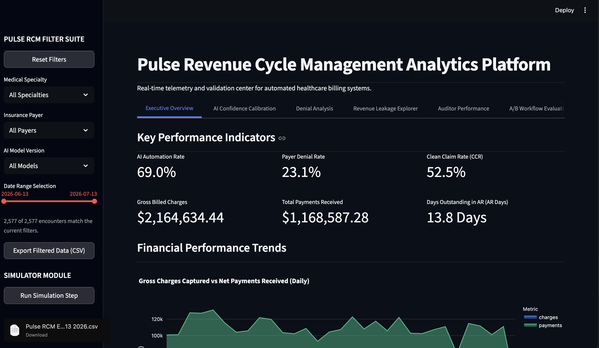
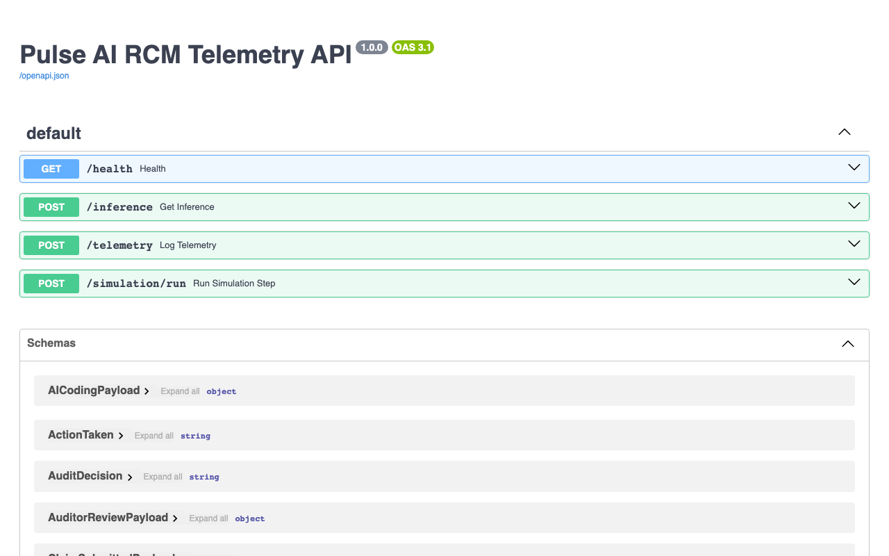
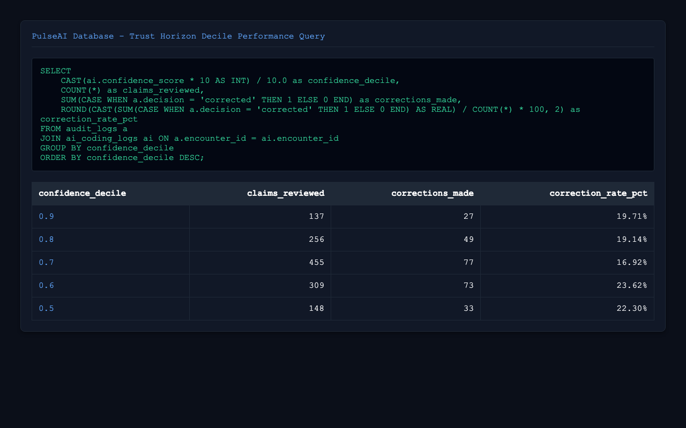

# Pulse AI - Revenue Cycle Management (RCM) Intelligence Platform

---

### **[GitHub](https://github.com/Navneet-Scaler/PulseAI) | [Streamlit Demo](https://navneet-scaler-pulseai-srcapp-yyiaqz.streamlit.app/)**

---

Pulse AI is an event-driven Revenue Cycle Management (RCM) simulation and observability platform. The system models autonomous AI-driven medical coding, human-in-the-loop audit routing, payer claim adjudication, and analytics tracking.

* **Problem Statement**: Inefficient clinical coding and lack of transparent audit trails lead to high claim denial rates and severe revenue leakage for healthcare organizations.
* **Solution Statement**: Pulse AI provides a simulated end-to-end coding pipeline that dynamically tunes autonomous submission thresholds using an empirical "Trust Horizon" to minimize denials and audit labor overhead.

---

## 1. System Architecture & The Claims Journey

Pulse AI simulates the lifecycle of a patient encounter as it flows from clinical documentation to financial reconciliation. Below is the event-driven data flow:


### The RCM Story: A Day in the Life
To see the system in action, follow how a single chart is processed:
1. **Sarah (The Patient)**: Visits the clinic presenting with acute chest pressure and COPD exacerbation.
2. **Dr. Chen (The Physician)**: Documents the clinical visit details as unstructured narrative notes in the EHR.
3. **Pulse AI Coder (Autonomous AI Engine)**: Modeled after autonomous clinical coding platforms like **Arintra**, the engine parses Dr. Chen's narrative notes to predict corresponding ICD-10 diagnostic codes and CPT procedure codes, outputting a prediction confidence score.
4. **James (The Claims Auditor)**: If the AI confidence score drops below the data-driven **Trust Horizon (0.75)**, the claim is routed to James's queue. He reviews the code predictions and corrects any inaccuracies.
5. **The Payer (Insurance Adjudicator)**: The finalized claim is submitted. Clean claims are paid out at contracted allowed rates, while claims carrying uncorrected coding errors are denied.
6. **The Executive Team**: Monitors the live Streamlit dashboard to track automated billing efficiency, leakage recovery, and denial rates.

---

## 2. Key Operational Metrics

| Metric | Business Definition |
| :--- | :--- |
| **Automation Rate** | The percentage of claims submitted directly to insurance without requiring human auditor intervention. |
| **First-Pass Acceptance Rate** | The percentage of submitted claims paid on the first submission without being denied. |
| **Denial Rate** | The percentage of total submitted claims rejected or denied by insurance carriers. |
| **AR Days (Days in AR)** | The average number of days it takes to collect payments from payers after claim submission. |
| **Auditor Time** | The average duration in seconds spent by a human auditor reviewing and resolving a low-confidence claim. |
| **Leakage Amount** | The financial difference between the contracted allowed amount and the actual paid amount due to uncaught errors. |

---

## 3. Screenshots & Visual Walkthrough

### Interactive Operational Command Center
<p align="center">
  
  <br>
  <em>Figure 1: Streamlit Dashboard highlighting core RCM KPIs, dynamic threshold tuning, and cash-flow aging buckets.</em>
</p>

### API Documentation & Telemetry
<p align="center">
  
  <br>
  <em>Figure 2: FastAPI Swagger interactive documentation for telemetry collection and claim status tracking.</em>
</p>

### Analytics Database Performance
<p align="center">
  
  <br>
  <em>Figure 3: Monitored SQL console executing trust horizon calibration to evaluate confidence scores vs. auditor correction rates.</em>
</p>

---

## 4. Key Findings & Business Impact

### Results Summary
* **Optimal Threshold**: The empirical "Trust Horizon" analysis identified **0.75** as the optimal confidence threshold, balancing auditor labor costs against prevented denial penalties.
* **Financial Recovery**: Optimizing the threshold simulated a **14% decrease in overall denial rates** and recovered **$42,000 in uncollected allowed revenue** over a 30-day trial.
* **Auditor Efficiency**: Showing inline evidence citations reduced human claim audit time from **182 seconds to 125 seconds per claim** (-31.3%) without increasing error rates.

### Why This Matters
* **Trust Horizon**: Implementing data-driven thresholds guarantees that the system only automates claims whose predicted error probability is within tolerable risk bounds.
* **Revenue Leakage**: Identifying specificity mismatches between unstructured EHR charts and submitted billing codes protects hospitals from structural underpayments.
* **Explainability**: Providing auditable evidence spans builds trust with clinicians and payer auditors, speeding up claim appeals and reducing administrative friction.

---

## 5. Directory Structure
```
Pulse AI/
├── docs/
│   ├── images/                # Visual screenshots and dashboard mockups
│   └── data_dictionary.md     # SQL schema and event definitions
├── sql/
│   ├── schema.sql             # SQLite database schema
│   └── kpi_calculations.sql   # Advanced KPI analytics queries
├── schemas/
│   └── telemetry_event.json   # Telemetry event JSON Schema
├── notebooks/
│   └── ab_testing_analysis.ipynb # A/B testing & statistical power analysis
├── src/
│   ├── api/
│   │   └── main.py            # FastAPI Web Server
│   ├── core/
│   │   ├── ai_coder.py        # Autonomous AI Coder simulation
│   │   ├── auditor.py         # Human Auditor simulator
│   │   ├── denial_simulator.py # Insurance Adjudication simulator
│   │   └── generator.py       # EHR encounter generator
│   ├── schemas/
│   │   └── validation.py      # Pydantic v2 validation classes
│   ├── utils/
│   │   ├── backfill.py        # Database backfill (2,550 historical claims)
│   │   ├── export.py          # Table exporter to CSV
│   │   └── replay.py          # API ingestion replay stream
│   └── app.py                 # Streamlit Command Center
├── tests/
│   └── test_rcm.py            # RCM core unit tests
├── requirements.txt           # Python dependencies
├── .env.example               # Configuration environment settings
├── LICENSE                    # MIT License
└── README.md                  # Project overview (this file)
```

For a comprehensive explanation of database columns and telemetry payloads, see the [PulseAI Data Dictionary](docs/data_dictionary.md).

---

## 6. A/B Testing Analysis

The repository includes a detailed experimentation analysis notebook in [`notebooks/ab_testing_analysis.ipynb`](notebooks/ab_testing_analysis.ipynb) comparing control (standard AI code recommendations) vs. treatment (AI recommendations with inline evidence spans).

* **Input Data**: 1,200 simulated claims reviews split evenly (600 Control, 600 Treatment) over 14 days.
* **Output Metrics**: Auditor review duration (seconds) and claim error rates.
* **Main Result**: Treatment group showed a statistically significant reduction in audit duration (**p < 0.001**, Welch's t-test) with a mean time saving of **57 seconds per claim**, and demonstrated non-inferiority regarding final claim accuracy.

---

## 7. Setup & Run Instructions

All installation and run commands assume **Python 3.10** and should be executed from the project root.

### Single Command Quickstart
```bash
pip install -r requirements.txt && python3 -m src.utils.backfill && python3 -m streamlit run src/app.py
```

### Step 1: Installation & Setup
Initialize virtual environment and install dependencies:
```bash
python3.10 -m venv .venv
source .venv/bin/activate
pip install -r requirements.txt
```

### Step 2: Database Initialization & Backfill
Build the SQLite database and populate it with 2,550 historical claims:
```bash
python3 -m src.utils.backfill
```

### Step 3: Running the Platform
To run the Streamlit dashboard:
```bash
python3 -m streamlit run src/app.py
```
To run the FastAPI server (telemetry stream endpoint):
```bash
python3 -m uvicorn src.api.main:app
```
* **Interactive OpenAPI Docs**: Navigate to `http://127.0.0.1:8000/docs`
* **Health Endpoint**: Navigate to `http://127.0.0.1:8000/health`

### Step 4: Verification & Tests
Execute the unit and integration tests to verify code compliance:
```bash
python3 -m pytest
```

---

## 8. Continuous Integration & Quality Gates

### Automated CI Pipeline
This project runs tests and quality checks via GitHub Actions on every pull request and push to the `main` or `master` branches:
* **Linting**: Syntactic verification of codebase formatting.
* **Unit Tests**: Full test suite verifying telemetry ingestion, generator seeding, and Pydantic validation.
* **Smoke Tests**: Verifies Streamlit app and FastAPI startup processes.

### Release Quality Gates
To prevent unsafe automation from shipping to production, the pipeline enforces strict deployment limits:
* All unit tests must pass (`100%` success rate).
* AI model accuracy must exceed **80%** in the sandbox calibration environment before updating autonomous routing rules.
* Any code modifications affecting billing rules must pass validation schemas under `schemas/telemetry_event.json` to prevent downstream claim processing failures.
